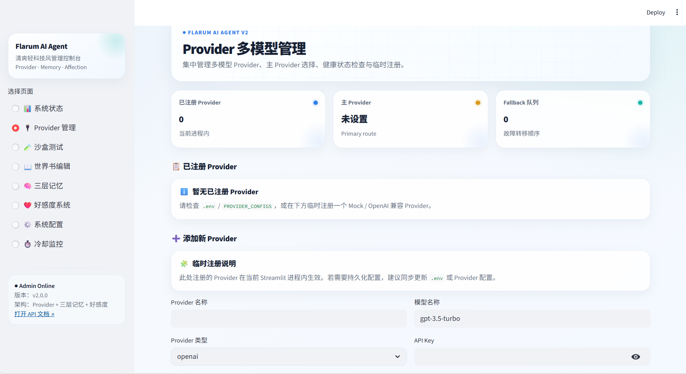

#  Flarum AI Agent

基于 FastAPI 的 Flarum 论坛智能回复机器人，采用"JSON世界书 + ChromaDB向量记忆"双轨架构。

> 此版本不包含真实 `.env`、真实世界书、用户记忆、好感度数据、ChromaDB 数据或沙盒报告。如有需要，请复制 `.env.example` 并自行创建 `data/worldbook.json` 或在管理后台创建 V3 世界书。

## ✨ 项目特性

- 🤖 **双轨架构**: JSON世界书提供结构化知识，ChromaDB实现动态语义记忆
- ⚡ **Webhook异步处理**: 使用 FastAPI BackgroundTasks，避免超时问题
- 🧠 **智能过滤**: 记忆价值评估函数 + 回复冷却机制，防止API滥用
- 🖥️ **可视化后台**: Streamlit管理界面，实时编辑世界书和配置
- 🐳 **容器化部署**: 完善的 Dockerfile 和 docker-compose 配置
- 🧪 **沙盒测试**: MockProvider 离线测试 + 独立 sandbox 目录，验证效果但不污染正式记忆
- 🛡️ **稳定存储**: V2 记忆/好感度 JSON 存储支持用户级并发锁、原子写入和损坏文件备份

## 📁 项目结构

```
Flarum_AI_Agent/
├── 📄 main.py                 # FastAPI 主入口
├── 📄 admin_ui.py             # Streamlit 管理后台
├── 📄 config.py               # 全局配置
├── 📄 requirements.txt        # Python依赖
├── 📄 sandbox_test.py         # 离线沙盒测试 Runner（不调用真实LLM/不发帖）
├── 📄 Dockerfile              # 容器镜像
├── 📄 docker-compose.yml      # 编排配置
├── 📄 .env.example            # 环境变量示例
├── 📁 api/                    # API路由
│   ├── __init__.py
│   └── webhook_listener.py    # Webhook接收器（含BackgroundTasks）
├── 📁 core/                   # 核心逻辑
│   ├── __init__.py
│   ├── llm_engine_v2.py       # V2 引擎：Provider + 三层记忆 + 好感度
│   ├── memory_manager.py      # ChromaDB记忆管理 + 价值评估
│   ├── cooldown_manager.py    # 回复冷却管理
│   ├── providers/             # 多Provider架构（含MockProvider沙盒模型）
│   ├── memory/                # 三层记忆系统（L1摘要/L2块/L3历史）
│   └── affection/             # 好感度/关系系统
├── 📁 tests/                  # 测试集
│   └── sandbox_cases.json     # 沙盒测试用例
├── 📁 utils/                  # 工具函数
│   └── __init__.py
└── 📁 data/                   # 数据存储（挂载卷，公开版只保留空目录）
    ├── worldbook.json         # 可选旧/兼容世界书文件（需自行创建）
    ├── worldbooks/            # V3 世界书数据（可在后台创建）
    ├── memory/                # 正式三层记忆数据（运行时生成）
    ├── affection/             # 正式好感度数据（运行时生成）
    └── sandbox/               # 沙盒测试数据与报告（运行时生成）
```

## 🚀 快速开始

> 第一次使用建议先阅读：[ 第一次使用指南](FIRST_USE_GUIDE.md)。它会按“安装依赖 → 沙盒测试 → 管理后台 → 真实 LLM → Webhook → Flarum”的顺序带你安全上手。

### 1. 环境准备

```bash
# 克隆项目
git clone <your-repo>
cd Flarum_AI_Agent

# 创建环境文件
cp .env.example .env

# 编辑 .env 配置
vim .env
```

### 2. 配置说明

编辑 `.env` 文件，填写以下必需配置：

```ini
# LLM API配置（支持OpenAI/智谱/通义千问/本地vLLM）
LLM_API_KEY=your-api-key
LLM_BASE_URL=https://api.openai.com/v1
LLM_MODEL=gpt-3.5-turbo

# Flarum论坛配置
FLARUM_BASE_URL=https://your-forum.com
FLARUM_API_TOKEN=your-flarum-token

# 系统人设（可选）
SYSTEM_PROMPT=You are a warm and helpful AI assistant for a Flarum community.
```

### 3. 启动服务

#### 方式一：Docker部署（推荐）

```bash
# 构建并启动
docker-compose up -d

# 查看日志
docker-compose logs -f

# 停止服务
docker-compose down
```

#### 方式二：本地开发

```bash
# 安装依赖
pip install -r requirements.txt

# 启动Webhook服务
python main.py

# 启动管理后台（另一个终端）
streamlit run admin_ui.py
```

### 4. 访问服务

| 服务 | 地址 | 说明 |
|------|------|------|
| Webhook | http://localhost:8000 | Flarum Webhook目标地址 |
| API文档 | http://localhost:8000/docs | Swagger UI |
| 管理后台 | http://localhost:8501 | Streamlit可视化界面 |

## 🧪 沙盒测试（推荐）

项目提供离线沙盒测试能力，用于验证 V2 主流程效果，同时避免污染正式记忆系统和真实论坛。

### 沙盒测试特点

- ✅ 默认使用 `MockProvider`，不调用真实 LLM API，不消耗额度
- ✅ 不调用 Flarum 发帖接口，不会向真实论坛发帖
- ✅ 使用独立目录：`data/sandbox/memory` 与 `data/sandbox/affection`
- ✅ 默认测试结束后清理沙盒记忆和好感度，仅保留测试报告
- ✅ 可验证回复生成、三层记忆、好感度增长、基础断言

### 运行沙盒测试

```bash
python sandbox_test.py
```

测试报告会写入：

```text
data/sandbox/reports/sandbox_report_YYYYMMDD_HHMMSS.json
```

### 常用参数

```bash
# 只运行某个用例
python sandbox_test.py --case emotional_support

# 测试结束后保留沙盒 memory/affection，便于人工检查
python sandbox_test.py --keep-data

# 使用自定义测试集
python sandbox_test.py --cases tests/sandbox_cases.json

# 使用自定义沙盒目录
python sandbox_test.py --sandbox-dir data/my_sandbox
```

### 当前内置用例

| 用例 | 目标 |
|------|------|
| `basic_memory` | 验证基础对话和短期记忆写入 |
| `emotional_support` | 验证情绪支持类回复 |
| `affection_growth` | 验证感谢/陪伴类互动带来的好感度增长 |

### 最近一次验证结果

已验证命令：

```powershell
python -m compileall core sandbox_test.py; if ($LASTEXITCODE -eq 0) { python sandbox_test.py }
```

结果：

- 编译通过
- 沙盒用例：3
- 通过：3
- 失败：0
- 沙盒 `memory/affection` 已清理，仅保留报告

> 注意：如果看到 `python-dotenv could not parse statement starting at line ...`，说明 `.env` 某一行格式可能有问题。MockProvider 沙盒测试不依赖真实 `.env`，但真实 LLM/Flarum 链路运行前建议修复。

## 🧠 双轨架构详解

### 世界书（JSON规则）
```json
{
  "categories": {
    "心理健康": {
      "patterns": ["抑郁|焦虑|失眠|压力|崩溃"],
      "responses": ["【紧急】你现在的感受一定很痛苦..."],
      "priority": "high",
      "alert_admin": true
    }
  }
}
```

### 向量记忆（ChromaDB）
- 自动存储有价值的对话历史
- 语义检索相似记忆
- 支持用户隐私删除

## ⚡ 核心机制

### 1. Webhook异步处理
```python
@router.post("/webhook")
async def receive_webhook(
    background_tasks: BackgroundTasks,
    payload: FlarumWebhookPayload
):
    # 立即返回，避免超时
    background_tasks.add_task(process_webhook_async, payload)
    return {"success": True}
```

### 2. 记忆价值评估
```python
def evaluate_memory_value(content: str) -> float:
    # 综合评分：长度 + 信息密度 + 情感深度
    if score < MEMORY_VALUE_THRESHOLD:
        return False  # 不存入记忆
```

### 3. 回复冷却机制
```python
def check_reply_cooldown(user_id: str) -> bool:
    # 紧急内容（自杀/自残）绕过冷却
    if is_urgent_content(content):
        return True
    return elapsed >= REPLY_COOLDOWN_SECONDS
```

### 4. V2 记忆写入过滤

Webhook 会先通过 `evaluate_memory_value()` 评估帖子价值，再将结果传入 V2 引擎：

```python
reply_content = await generate_reply_v2(
    user_id=user_id,
    user_message=user_text,
    save_memory=should_save_memory
)
```

低价值内容仍可获得回复，但不会写入三层记忆，避免长期记忆被水帖污染。

### 5. JSON 存储稳定性

V2 的三层记忆和好感度系统采用轻量 JSON 文件存储，并已加入稳定性保护：

- 同一用户使用 `asyncio.Lock` 串行读写，避免并发覆盖
- 写入采用 `.tmp` 临时文件 + `Path.replace()` 原子替换
- JSON 加载失败时自动备份为 `.corrupt.时间戳` 文件
- 沙盒测试使用独立 `data/sandbox` 目录，不影响正式数据

## 🖥️ 管理后台功能

- 📊 **系统状态**: 实时监控服务健康状态
- 📖 **世界书编辑**: 可视化编辑分类、规则、回复模板
- ⚙️ **系统配置**: 修改API密钥、人设Prompt等
- 🧠 **记忆管理**: 查看和管理ChromaDB记忆（开发中）
- ⏱️ **冷却监控**: 查看用户冷却状态、白名单管理

## 🔧 开发计划

- [x] 项目骨架搭建
- [x] Webhook接收 + BackgroundTasks
- [x] 世界书JSON配置
- [x] 冷却管理器
- [x] Streamlit管理后台
- [x] Docker容器化
- [x] ChromaDB向量记忆完整集成
- [x] LLM API调用实现
- [x] Flarum API发帖实现
- [x] 世界书正则匹配引擎
- [x] **V2升级**: Provider多模型故障转移架构
- [x] **V2升级**: 三层记忆系统 (L1摘要/L2块/L3历史)
- [x] **V2升级**: 增量总结策略 (每2块触发AI总结)
- [x] **V2升级**: 双模型Embedding (BGE+Qwen)
- [x] **V2升级**: 好感度系统 (5级互动关系)
- [x] **V2升级**: LLMEngineV2重构集成
- [x] **V2稳定性**: save_memory 记忆过滤链路打通
- [x] **V2稳定性**: Provider配置自动加载
- [x] **V2稳定性**: 三层记忆/好感度 JSON 并发安全与原子写入
- [x] **测试能力**: MockProvider + 离线沙盒测试 Runner
- [ ] 完整 pytest 测试套件

## 🎉 V2 工业级升级

### 新增核心架构

| 模块 | 功能 | 状态 |
|------|------|------|
| **Provider架构** | 多模型故障转移 (OpenAI/DeepSeek/Qwen) | ✅ |
| **三层记忆系统** | L1摘要层 + L2块层 + L3历史层 | ✅ |
| **增量总结引擎** | 每2个块自动触发AI总结 | ✅ |
| **双Embedding** | BGE-M3本地 + Qwen API | ✅ |
| **好感度系统** | 5级关系 + 智能奖励机制 | ✅ |
| **LLMEngineV2** | 集成所有新系统的完整引擎 | ✅ |
| **MockProvider** | 离线沙盒测试模型，不调用真实API | ✅ |
| **沙盒测试Runner** | 独立数据目录 + 测试报告 + 自动清理 | ✅ |
| **稳定JSON存储** | 用户级锁 + 原子写入 + 损坏备份 | ✅ |

详见: [UPGRADE_V2_README.md](UPGRADE_V2_README.md) | [测试指南](TESTING_GUIDE.md)



## 📄 许可证

MIT License

## 🤝 贡献

欢迎Issue和PR！

---

 **Flarum AI Agent** - 用 AI 温暖每一个社区里的声音
